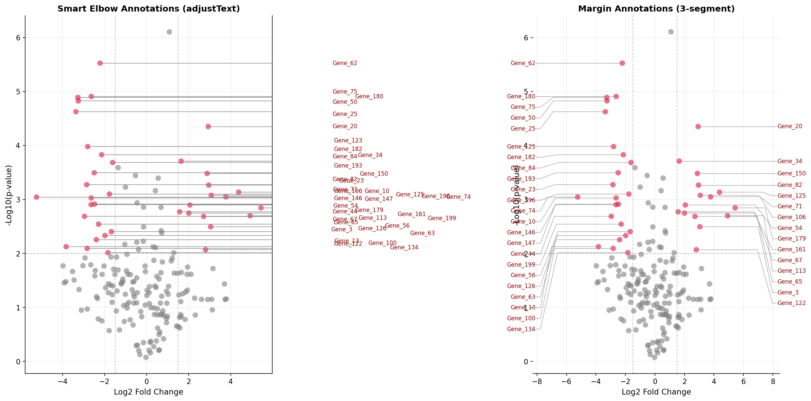

# PyForce

Python implementation of ggforce-style annotations for matplotlib.

PyForce brings the elegant annotation capabilities of R's [ggforce](https://github.com/thomasp85/ggforce) package to Python's matplotlib. Create publication-quality visualizations with smart point annotations and convex hull groupings.

## Features

**Smart Point Annotations** with `annotate_points()`:
- Elbow-style connectors with horizontal final segments for clarity
- Lines start from marker edges, not centers
- Connectors only drawn when labels are pushed away from points
- Automatic text alignment based on label position
- Uses adjustText for collision-free label placement
- Configurable repulsion forces for fine-tuning

**Convex Hull Groupings** with `geom_mark_hull()`:
- Smooth, expanded boundaries around point groups
- Cubic spline interpolation for aesthetic curves
- Same elbow connector style as point annotations
- Smart label positioning away from data points

## Installation

```bash
pip install pyforce
```

Or install from source:

```bash
git clone https://github.com/yourusername/pyforce
cd pyforce
pip install -e .
```

## Examples

### Annotating Points (Volcano Plot)

Create publication-ready volcano plots with automatic label positioning:

```python
import matplotlib.pyplot as plt
import numpy as np

from pyforce import annotate_points

# Generate data
np.random.seed(42)
n_points = 200
log_fc = np.random.randn(n_points) * 2
neg_log_p = np.abs(np.random.randn(n_points)) * 1.5 + np.abs(log_fc) * 0.3

# Identify significant points
significant = (np.abs(log_fc) > 1.5) & (neg_log_p > 2)
sig_indices = np.where(significant)[0]
gene_names = [f"Gene_{i}" for i in sig_indices]

# Create plot
fig, ax = plt.subplots(figsize=(12, 9))
colors = np.where(significant, "crimson", "gray")
ax.scatter(log_fc, neg_log_p, c=colors, s=60, alpha=0.6)

# Smart annotations
annotate_points(
    ax,
    log_fc,
    neg_log_p,
    labels=gene_names,
    indices=sig_indices,
    point_size=60,
    label_fontsize=8,
    label_color="darkred",
    connection_color="gray",
    force_points=1.5,   # Repulsion from points
    expand_points=3.0,  # Collision box size
)

plt.show()
```



### Hull Annotations (Clustered Data)

Annotate groups of points with smooth convex hulls:

```python
import matplotlib.pyplot as plt
import numpy as np

from pyforce import geom_mark_hull

# Generate clustered data
np.random.seed(42)
cluster1 = np.random.randn(20, 2) * 0.5 + np.array([2, 2])
cluster2 = np.random.randn(25, 2) * 0.6 + np.array([-2, 1])
cluster3 = np.random.randn(18, 2) * 0.4 + np.array([0, -2])

points = np.vstack([cluster1, cluster2, cluster3])
x, y = points[:, 0], points[:, 1]
groups = np.array([0] * 20 + [1] * 25 + [2] * 18)

# Create plot
fig, ax = plt.subplots(figsize=(10, 8))
colors = ["#E63946", "#457B9D", "#2A9D8F"]

for cluster, color in zip([cluster1, cluster2, cluster3], colors):
    ax.scatter(cluster[:, 0], cluster[:, 1], c=color, s=60, alpha=0.7)

# Hull annotations with elbow connectors
geom_mark_hull(
    ax,
    x,
    y,
    groups=groups,
    labels=["Cluster A", "Cluster B", "Cluster C"],
    hull_color=colors,
    hull_fill=colors,
    hull_alpha=0.12,
    label_fontsize=11,
    label_fontweight="bold",
    elbow_angle=45.0,
)

plt.show()
```


## API Reference

### `annotate_points()`

Annotate points with smart elbow connectors.

| Parameter | Type | Default | Description |
|-----------|------|---------|-------------|
| `ax` | Axes | required | Matplotlib axes to draw on |
| `x`, `y` | array-like | required | All point coordinates |
| `labels` | list[str] | required | Text labels for points |
| `indices` | array-like | None | Indices of points to annotate |
| `point_size` | float | 40 | Scatter point size for edge calculation |
| `min_distance_for_connector` | float | 0.3 | Min distance before drawing connector |
| `label_fontsize` | int | 10 | Font size |
| `label_color` | str | 'black' | Text color |
| `connection_linewidth` | float | 1.0 | Connector line width |
| `connection_color` | str | 'gray' | Connector color |
| `elbow_angle` | float | 45.0 | Diagonal segment angle (degrees) |
| `force_points` | float | 1.0 | Repulsion force from points |
| `force_text` | float | 0.8 | Repulsion between labels |
| `expand_points` | float | 2.0 | Point collision box expansion |
| `expand_text` | float | 1.5 | Text collision box expansion |

### `geom_mark_hull()`

Annotate groups with convex hulls and elbow connectors.

| Parameter | Type | Default | Description |
|-----------|------|---------|-------------|
| `ax` | Axes | required | Matplotlib axes to draw on |
| `x`, `y` | array-like | required | Point coordinates |
| `groups` | array-like | None | Group membership |
| `labels` | list[str] | None | Labels for each group |
| `descriptions` | list[str] | None | Additional description text |
| `hull_color` | str/list | 'black' | Hull boundary color(s) |
| `hull_fill` | str/list | None | Hull fill color(s) |
| `hull_alpha` | float | 0.2 | Fill transparency |
| `expand_factor` | float | 0.12 | Hull expansion factor |
| `label_fontsize` | int | 12 | Font size |
| `connection_linewidth` | float | 1.5 | Connector width |
| `connection_color` | str | 'black' | Connector color |
| `elbow_angle` | float | 45.0 | Diagonal segment angle |

## Requirements

- Python >= 3.8
- numpy >= 1.20.0
- matplotlib >= 3.5.0
- scipy >= 1.7.0
- adjustText >= 0.8

## Contributing

Contributions are welcome! Please feel free to submit a Pull Request.

## License

MIT License. See LICENSE file for details.

## Acknowledgments

Inspired by Thomas Lin Pedersen's excellent [ggforce](https://github.com/thomasp85/ggforce) package for R.
